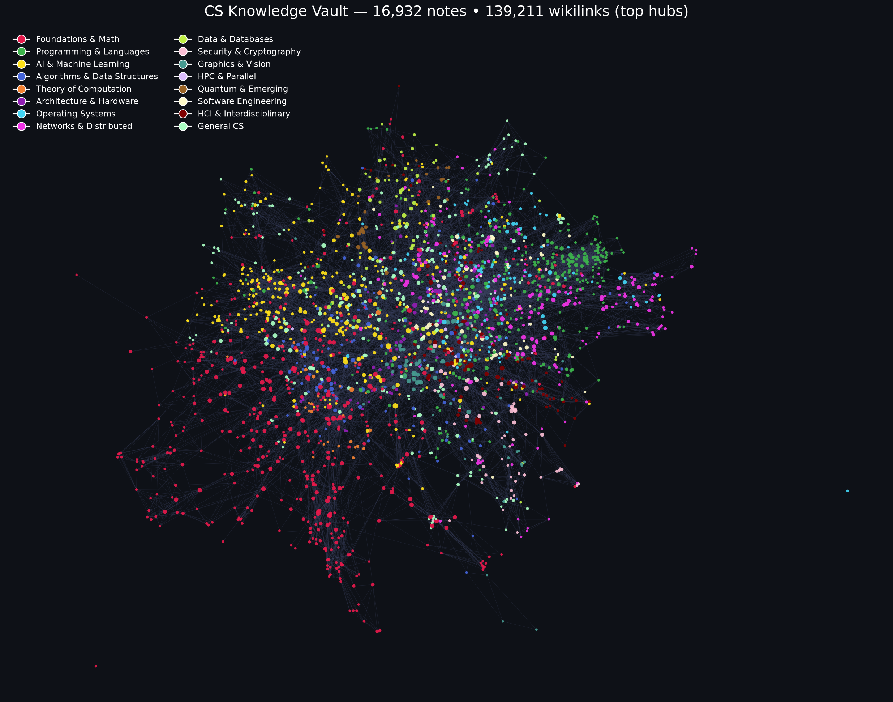

# CS Knowledge Vault

Full-breadth Computer Science knowledge base in Obsidian format.

- **Topics:** 15,990 notes with real Wikipedia content (CC BY-SA)
- **Courses:** 61 OSSU + 822 MIT OCW (real links)
- **Frontier:** 40 arXiv research areas
- **Maps of Content** for every domain; **16,932 notes · 139,211 wikilinks** across everything

Open as an Obsidian vault: `File → Open folder as vault` → this folder.

**Sources:** Wikipedia (CC BY-SA), OSSU curriculum, MIT OpenCourseWare, arXiv. Every note links its source.

## Domain map

| Folder | Domain |
|---|---|
| `00-General` | General CS |
| `01-Foundations` | Foundations & Math |
| `02-Programming-Languages` | Programming & Languages |
| `03-AI-Machine-Learning` | AI & Machine Learning |
| `04-Algorithms-Data-Structures` | Algorithms & Data Structures |
| `05-Theory-Computation` | Theory of Computation |
| `06-Architecture-Hardware` | Architecture & Hardware |
| `07-Operating-Systems` | Operating Systems |
| `08-Networks-Distributed` | Networks & Distributed |
| `09-Data-Databases` | Data & Databases |
| `10-Security-Cryptography` | Security & Cryptography |
| `11-Graphics-Vision` | Graphics & Vision |
| `12-HPC-Parallel` | HPC & Parallel |
| `13-Quantum-Emerging` | Quantum & Emerging |
| `14-Software-Engineering` | Software Engineering |
| `15-HCI-Interdisciplinary` | HCI & Interdisciplinary |
| `16-Courses` | OSSU + MIT OCW courses |
| `17-Frontier` | arXiv research areas |

Start at **[00-HOME](00-HOME.md)**.
